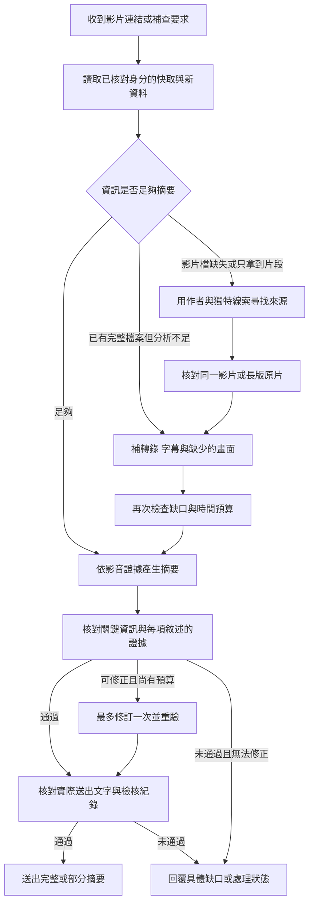

# NINAX 影片補查流程與摘要完整性檢核規劃

狀態：規劃定稿 v1.1。實作與驗證紀錄見 [video-loop/IMPLEMENTATION.md](video-loop/IMPLEMENTATION.md)；下列現況是實作前基準。2026-09-07 核對正式主機時，4 份影片 hook 的 SHA256 與上版規劃基準相同。

目標是讓 NINAX 先判斷影片缺少哪些資訊，再使用已取得的作者、文案、字幕、畫面與影片 ID 補查；取得足夠證據後產生摘要。不能把「有文字可寫」當成「影片內容已掌握」。

首版設計值：每次分析最多 5 分鐘，可查找同作者跨平台的同一影片或完整原片；最多 3 組查詢、3 個候選、1 次摘要修訂。這些是可調整的設計值，不是速度保證或已確認的個人偏好。

完成定義：補查有明確觸發與停止條件，資料取得狀態與摘要檢核結果分開記錄；只有來源、關鍵資訊與實際送出文字都通過檢查，才回覆已完成摘要。資料不足時可以回覆經檢核的部分摘要，但必須具體指出缺口。

## 1. 目前的缺口

本次重新讀取正式主機程式，確認以下行為：

- `video_takeaway_cascade.py` 的 `cascade()` 在任何來源產生非空草稿後就返回，包含只有貼文說明的快取。
- `find_job()` 偏好有逐字稿的 job，但未評估轉錄是否涵蓋完整影音、是否缺少重要畫面。
- `video-url-prefetch.sh` 遇到追問且有舊草稿時，直接回傳 `session-cache`；「完整一點」不一定取得新資料。
- 正式版 `enrich_cached_video.py` 已加入帶時間戳的 Whisper 轉錄與畫面分析，但視覺分析固定限制 3 張；部分舊快取仍沒有時間戳或畫面資料。
- `render_takeaway.py` 已能讀取 `visual.json`，應沿用這項更新。這兩份檔案已與上一輪修復備份不同，實作時必須保留最新修改。
- 現有 `pipeline.py` 已有片長檢查、音訊切段、字幕、畫面篩選、影像雜湊、OCR 選項及快取。CLI 的畫面張數預設會依片長調整為 8–40 張，可以先沿用。
- Bot 的原生搜尋與擷取目前自動選擇 `exa`；本回合只驗證選擇結果，尚未進行該主機的搜尋連線驗收。
- 新增確認：舊 `video-takeaway-guard` 以字數和標題數判斷完整度，不能檢查事實與遺漏。Hermes 的 `transform_llm_output` 回傳空值時不會阻止送出，且 hook 逾時會放行原文；它不能單獨承擔最後一道檢核。

## 2. 建議流程

### 第一輪：取得資料並列出缺口

保留現有下載、Bright Data、Apify 與預覽來源，在共用的停止判斷加入品質檢查。資料不足時保留成果，繼續第二輪。

品質判斷分開記錄：

| 面向 | 檢查方式 |
|---|---|
| 影片身分 | 使用平台與大小寫正確的影片 ID、原始頁面及作者；不靠資料夾名稱或相似標題判定。 |
| 媒體取得 | 檔案可正常解碼到結尾；本機片長與來源片長交叉核對。來源未提供片長時記為未知。 |
| 語音與字幕 | 記錄實際處理過的音訊區段、失敗區段及時間戳。不能用文字長度或有無 `transcript.json` 判定完整度；安靜區段也不算轉錄失敗。 |
| 畫面資訊 | 記錄觀察的時間點與重要缺口，至少涵蓋開頭、中段、結尾；畫面承載主要內容的影片需要更多分析。抽樣分析不能稱為逐幀看完。 |
| 摘要所需內容 | 口播檢查主要主張、條件與結論；教學檢查步驟及例外；劇情檢查轉折與結尾。無語音影片依畫面與文字判斷。 |

輸出使用 `ready / partial / insufficient`，並附 `missing_evidence`。`ready` 代表足以支撐摘要，不代表理解了每個細節，也不輸出沒有依據的完整度百分比。

### 補查觸發與停止規則

| 發現的情況 | 下一步 | 何時停止 |
|---|---|---|
| 媒體不存在、不能解碼或片長明顯不符 | 重新解析原網址；必要時查找已核對的替代來源 | 取得相符媒體，或候選／預算用盡 |
| 僅有文案、無時間戳的文字，或音訊處理有缺段 | 查字幕並補缺段轉錄 | 相關區段已處理，或缺段原因已確認且無可用來源 |
| 片尾、轉折、字幕變化等重要畫面未分析 | 補該區段畫面與可見文字 | 關鍵缺口已有證據，或媒體仍不可取得 |
| 摘要漏掉已取得的重點、數字或限制 | 使用既有證據修訂摘要 | 修訂後通過，或 1 次修訂額度／時間用盡 |
| 內容互相矛盾、名字或數字辨識不明 | 針對該處交叉核對影音、字幕或原作者資料 | 矛盾已解決，或明確保留不確定性 |
| 使用者要求「完整一點／補查」 | 重新評估缺口，選取尚未做過且有希望補齊的動作 | 得到新證據，或證明此次沒有可行的新動作 |

同一組「正規來源＋查詢／處理參數＋證據版本」不重複執行。只有網址更新、新候選、新區段或不同分析設定，才算新的補查動作。排除不符候選不會消耗摘要修訂額度。

停止補查不等於檢核通過。預算用完時仍依資料狀態產生部分摘要或狀態回覆，不能因逾時而改標為 `ready`。

### 第二輪 A：已取得影片，就補分析

- 先用現有 `probe_video()` 與音訊分段紀錄確認下載、解碼及處理範圍。
- 有官方字幕時優先讀取，再以語音辨識補缺段；既有管線與 [yt-dlp 字幕選項](https://github.com/yt-dlp/yt-dlp#subtitle-options) 可沿用。
- 缺少畫面時，取消第二輪固定 3 張的限制，先使用既有依片長調整的上限，再優先補片尾、轉折及畫面文字變化處。
- 已分析過且指紋相同的音訊、畫面直接重用；更新的採樣設定或模型結果不能錯用舊快取。
- 補分析結果依本次執行的 job／manifest 核對，不從多個歷史工作中任意取最新結果。
- 先重試缺失區段；只有取得明確的低品質轉錄證據，才使用已配置的其他轉錄來源處理那些區段。

例如一支 14.6 秒影片只有 15 字的來源文字且缺少畫面分析，應先判斷它是否以音樂、動作或畫面字幕為主，再補畫面，不能直接假定 15 字已代表全部內容。

### 第二輪 B：缺少影片，就用線索查原片

依序使用成本較低且關聯較強的線索：

1. 重新解析原始網址、正規網址及作者頁；下載網址過期時取得新的媒體網址。
2. 使用作者帳號加文案中的獨特句子搜尋，優先原作者公開頁面。
3. 使用已辨識的獨特口白、畫面文字、水印或標題，再找同作者的跨平台版本、原文連出的長版。

最多產生 3 組查詢、檢視 3 個候選。先查頁面資訊並排除不符候選，再下載最有把握的來源。查詢只包含影片的公開線索，不包含聊天紀錄、憑證或帶簽章的媒體網址。

搜尋遵循 AnySearch 優先規則。實作時先確認正式 Linux 主機可用的官方 CLI 或介面；目前 Windows 的輪替 wrapper 使用 `msvcrt`，不能直接搬到 Linux。沿用既有帳戶授權，不建立新帳戶或保存新金鑰。AnySearch 無法使用時，才使用經連線驗證的 Hermes 原生搜尋；目前選擇為 Exa。

搜尋摘要只能當線索。每個候選必須開啟來源頁面，核對作者與影片內容：

- **同一貼文**：正規網址與 ID 一致。
- **同一影片的跨平台版本**：作者來源有可信關聯，且口白、畫面或字幕具有可定位的重疊；標題相同不夠。
- **長版原片**：記錄原短片對應的時間區段。長版其他段落只能標為補充，不可當成原短片本來就說過的內容。
- **相關文章或其他影片**：只能提供另外標示的背景，不能補成這支影片的劇情、步驟或結論。

找到的頁面文字一律作為待查資料，不當成執行命令。身分無法確認的候選不併入摘要。

### 最後：整合證據，再生成摘要

影音、字幕、文案及外部補充各自保留來源。摘要的關鍵敘述可回查到影片時間點或來源段落；有衝突就說明，不用推測補齊。

依影片類型組織答案：一句話主旨、內容發展或主要步驟、關鍵結論／結尾。有補查來源時附上連結。只有存在影響理解的缺口時，才簡短列出仍未確認的內容。

追問分成兩類處理：「再說一次」可重用摘要；「完整一點／補查／再查一次」檢查缺口與新線索，執行一次有差異的補查。沒有新證據時不得把改寫舊草稿說成已補齊。

## 3. 摘要完整性檢核

### 3.1 先列出必須保留的內容

從本次已驗證的逐字稿、字幕及畫面建立 `must_cover` 清單，先於摘要產生；每點包含 ID、來源片段與重要性，不能從摘要反推清單，否則已漏掉的內容永遠不會被發現。

優先使用既有時間軸與畫面分析資料建立清單；需要模型整理時，與初稿共用一次結構化呼叫，先列證據重點再寫摘要。後續檢核另讀來源尋找遺漏，不能只核對初稿自己列出的清單。證據包超出可處理範圍時保留區段索引並列出未處理部分，不默默截掉片尾。

| 影片類型 | 有證據時必須涵蓋的內容 |
|---|---|
| 教學／示範 | 目的、前提、操作順序、關鍵參數與單位、限制／例外、最後結果 |
| 劇情／娛樂 | 情境、主要行動、衝突、轉折與結尾；笑點必須由實際片段支持 |
| 觀點／知識 | 主張、理由、適用條件、保留語氣、反例或限制、結論 |
| 產品／服務 | 實際展示、用途與操作、明示限制；價格或導流僅在影片有提到時列入 |
| 音樂／無語音／畫面型 | 主體、動作或畫面變化、可見文字、重要開頭與結尾；辨識不明的作品與人名不推定 |

只列與使用者問題及影片主旨有關的重要內容，不要求把每句話放進摘要。未知的片尾或未處理區段記入 `missing_evidence`，不捏造一個待摘要的「結論」。

### 3.2 檢核表與退回原因

| 檢核 | 通過標準 | 不通過的處理 |
|---|---|---|
| 來源與任務一致 | profile、session、turn、影片身分與證據版本全部相符 | 阻止舊 job、其他影片或過期檢核紀錄送出 |
| 重要敘述有依據 | 每項實質敘述能定位到支持它的來源，且來源確實支持該敘述 | 補證據、刪除無依據內容或保留不確定性；不能只補一個形式上的引用 |
| 關鍵內容沒有漏 | `must_cover` 的必要項目均已表達，尤其是結尾、限制與例外 | 使用既有證據補寫遺漏，無須重新搜尋整支影片 |
| 數字、單位、條件及否定正確 | 不把「可能」寫成「一定」、不漏「不能／僅限」、不改變步驟順序及人物關係 | 精準修訂；原始辨識有疑義時回查相關片段 |
| 原片與補充資料分明 | 原片內容、長版對應區段及外部背景各有來源身分 | 移除錯誤混用，或將長版／背景明確標為補充 |
| 範圍與語氣誠實 | 抽樣畫面、未取得區段與文字來源的限制如實保留 | 修正「完整看完／片尾就是」等無法支持的說法 |
| 實際送出內容一致 | LINE 格式轉換與分段後仍保留已通過的內容，無裁切、舊版本或重複送出 | 重新核對實際 payload；不能只檢查 `render_takeaway.py` 的草稿 |

實作採兩層檢查：程式先核對來源 ID、時間戳範圍、必要欄位與文字指紋，再由既有模型核對敘述是否受證據支持及是否漏掉必要重點。模型只讀本次證據包與候選摘要；檢核結果需要列出問題及來源 ID，不能只回覆「看起來完整」或一個信心分數。

來源與時間戳有效，不代表敘述必然正確；模型複核也不是正確性的證明。代表案例仍需人工對照片段檢查語意，尤其是反諷、否定、數字與結尾。

### 3.3 修訂上限與最終狀態

正常路徑為「產生摘要一次 → 檢核一次」。若有可修正問題且尚有預算，允許「修訂一次 → 重驗一次」。最壞上限為 1 次初稿、2 次檢核、1 次修訂，全部共用任務截止時間，不啟動無限自我檢討。

檢核結果使用 `pass / revise / blocked / not_checked`。`pass` 要求本次可確認的必要重點已保留、沒有未處理的重大事實錯誤，且範圍限制已說明。

| 證據狀態 | 摘要檢核 | 對使用者回覆 |
|---|---|---|
| `ready` | `pass` | 可回覆完成的摘要，仍不宣稱逐幀理解所有細節 |
| `partial` | `pass` | 回覆已確認內容，並指明缺哪一段或哪一種資料 |
| `insufficient` | 任意 | 回覆取得情況、具體缺口及可用原片連結，不生成劇情或完整步驟 |
| 任意 | `revise / blocked / not_checked` | 修訂重驗；無法通過時只回覆處理狀態，不能放行未檢核的新稿 |

「部分摘要」也必須通過事實檢核，只是來源覆蓋仍有限。檢核服務逾時、回傳格式錯誤或中斷，一律不能當作 `pass`。若有同一任務、同一證據版本先前已通過的摘要，可以明確使用該版本。

### 3.4 檢查最後送出的版本

已確認的 Hermes 行為：`agent/turn_finalizer.py` 在模型回合後呼叫 `transform_llm_output`；`hermes_cli/plugins_dispatch.py` 對此 hook 的逾時採放行原文。LINE 的 `send()` 又會先把內容存入慢回覆快取，再呼叫傳送 API。因此只加一個輸出 hook 不足以阻止未檢核內容送出。

採用以下接法：

1. 在既有 `TurnRunner` 整理最終回應的工作階段執行檢核與必要修訂，處理的文字必須包含前面所有模型改寫結果；長時間檢核不放在 LINE API 的傳送重試中。
2. 使用伺服器產生的 profile／session／turn／影片 key 綁定本次任務，不能由模型自行宣稱已檢核。審核模型不啟用工具或補查 hook，避免遞迴。
3. 將通過結果與實際 payload 指紋原子寫入本 job 的 `evidence.json`；LINE `send()` 在寫入慢回覆快取前，快速核對任務身分、證據版本、檢核狀態與 payload。
4. 慢回覆按鈕取件、reply／push 備援也要對應該已通過版本。影片回合在檢核前只顯示處理狀態，不預先串流候選摘要。
5. 檢核紀錄缺失、不相符或讀取失敗時，最後一層回覆固定狀態文字，不回傳原候選稿。候選稿與實際送出版分別留證，會話紀錄與實際回覆對齊。

這一層只做快速資料比對，不呼叫模型或搜尋。確定性的排版調整可共用同一正規化函式；若改變了數字、條件、來源連結或正文，必須重新檢核。

## 4. 時間、費用與 LINE 回覆

以下是首版預算，需以實測調整，不是速度保證：

| 階段 | 共享 300 秒預算中的配置 |
|---|---:|
| 第一輪取得資料與初次判斷 | 最多 70 秒 |
| 第二輪搜尋與候選核對 | 最多 40 秒 |
| 補抓、缺段轉錄與畫面分析 | 最多 100 秒 |
| 摘要、檢核、必要修訂及送出 | 保留 80 秒 |
| 緩衝 | 10 秒 |

第一輪若已足夠就直接進入摘要與檢核。不能保留原本最多 250 秒的第一輪，再額外疊加第二輪；所有子程序共用截止時間。最後 80 秒暫分為初稿 30、首次檢核 15、必要修訂 15、重驗 10、送出 10 秒，未用時間可以流用；不足以完成下一次呼叫時，直接走已定義的降級狀態。

不論是哪一條分支，都須保留檢核及送出的時間；前面沒有用到的時間可用於補查或檢核。遠端抓取已受理但逾時時保存 task ID，不把本地停止等待當成遠端任務已取消，也不重新送出同一筆計費工作。

額外使用按量計費的抓取來源，第二輪最多新增 1 次呼叫；整體沿用既有帳戶額度，上線前核對現有額度與限制。搜尋與視覺分析也必須遵守任務呼叫上限。

沿用 LINE 既有的慢回覆處理。只有補查確實啟動後，才顯示「正在補查原片與缺少的片段」。完成後送出最後摘要；驗收必須包含回覆 token 到期後的實際送達情況。

送出紀錄綁定 turn 與摘要版本，正常流程避免重複發送。若請求可能已被 LINE 接收，但未取得確定回應，記錄 `delivery_uncertain`，不能直接宣稱未送達並重複推送。

超過預算、原片不公開或候選無法確認時，回傳已確認內容與具體缺口，保留進度。不能承諾每支影片都能找到公開的完整版。長版超出本次預算時，附原片與已分析範圍，不宣稱整支長片已分析完成。

## 5. 最小實作範圍與順序

**第一階段：停止過早完成，讓追問確實補資料。**

修改 `video_takeaway_cascade.py` 的共用停止條件、`enrich_cached_video.py` 的缺口補分析，以及 `video-url-prefetch.sh` 的追問分流。先用既有 job 驗證，不重建影音管線。

**第二階段：接上有上限的來源查找。**

沿用現有搜尋介面與抓取器；若需要協調候選查找，只新增一個小型 helper。候選、查詢與失敗原因寫回同一 job。

**第三階段：摘要檢核、送出檢查與 LINE 驗收。**

調整 `render_takeaway.py` 讀取補查證據及 `must_cover`；新增一個小型摘要檢核 helper，供 TurnRunner 與 LINE 最後一層共同使用。必要接點為 `gateway/run_turn_runner.py`、`plugins/platforms/line/adapter.py`，並確認影片回合的串流設定與 turn metadata 傳遞；先驗證現有介面，再做有界修改。同步更新 `skills/media/video-timeline-pipeline/SKILL.md` 中互相重複的級聯敘述及「追問只用快取」規則。

每個 job 新增一份 `evidence.json`，集中保存來源身分、媒體指紋、處理區段、缺口、候選關係、查詢紀錄與重試時間；摘要檢核也寫在同一份紀錄。

| 最小資料欄位 | 用途 |
|---|---|
| `schema_version`、`task` | profile、session、turn 與影片 key；區分不同使用者、影片及補查回合 |
| `evidence_revision`、`evidence_status` | 證據指紋與 `ready / partial / insufficient` |
| `sources`、`processed_ranges`、`missing_evidence` | 原始來源、實際處理範圍及尚缺內容 |
| `must_cover` | 事先列出的必要重點、對應來源及重要性 |
| `recovery` | 已做查詢、候選核對理由、呼叫數、停止原因及遠端 task ID |
| `summary_audit` | `candidate_hash`、狀態、檢核輪次、遺漏項目、無依據敘述及事實衝突 |
| `approved_delivery` | 已通過的 payload 指紋、綁定的證據與任務版本、回覆範圍 |

原始抓取資料與既有摘要保留。沿用現有 job 鎖與原子寫入；資料與檢核皆合格的快取可直接使用。證據、分析設定或必要檢核版本改變時，舊摘要需重新檢核。重啟後只採用完整寫入且仍相符的紀錄，不把殘留的 `pending` 當成完成。

同一影片可共用媒體證據，但各回合的需求、檢核與送出紀錄以 `turns[turn_key]` 分開保存，避免並行要求互相覆寫。快取可否重用也須納入使用者問題的指紋；新回合不能直接沿用另一回合的送出憑據。

實作前重新比對正式檔案，備份後再修改，保留本次發現的語音與畫面更新。主機控制權及入口配置沿用現況。

## 6. 驗收案例與通過標準

保留一個可執行的整合檢查，使用固定資料驗證分支，再做真實影片與 LINE 測試：

1. 已完整的快取：不啟動第二輪、不重新下載影音。
2. 只有文案的快取：不能提前當成完成，必須嘗試補查。
3. 78 秒舊影片：確認語音處理範圍，補畫面及片尾，關鍵摘要可回查證據。
4. 14.6 秒音樂／畫面型影片：不把少量文字當完整內容，也不因無語音就判定失敗。
5. 過期媒體網址：更新同一影片的媒體來源，不重用其他影片的 job。
6. 跨平台相似標題或不同剪輯：拒絕錯誤配對；長版需留下對應區段。
7. 「完整一點」：確實取得新的證據，或明確回報補查沒有增加內容，不能只重貼舊草稿。
8. 候選找不到、供應商失敗或逾時：時間與呼叫上限有效，子程序停止，結果不宣稱完整。
9. 真實 LINE 對話：確認延遲後最後摘要只送一次，手機收到完整內容，附帶的來源可打開。

摘要檢核另加入下列固定反例；每個反例都需要「錯誤版本會失敗、修正版本會通過」的成對資料：

- 長篇且格式完整，卻漏掉影片結尾、前提或關鍵例外。
- 數字正確但單位錯誤、順序顛倒、漏否定，或把可能性改成保證。
- 引用的來源 ID 存在，但並不支持該敘述；或時間戳超出來源片段。
- 把相似影片、長版其他片段或相關文章寫成原短片的內容。
- 審核逾時／格式錯誤、證據更新後沿用舊 pass、A 影片的檢核紀錄套到 B 影片。
- 同一影片同時有兩個回合補查，檢核紀錄不互相覆寫，兩個回合都能取得各自相符的結果。
- 檢核完成後內容又被改寫或裁切、串流提前露出候選稿、慢回覆按鈕取出未檢核稿。

通過標準：

1. 固定反例集全部被攔下；通過樣本的必要重點全數有涵蓋，且沒有未處理的重大事實錯誤。
2. 代表影片由人工對照已標記片段確認，不能只採用模型自己的 pass。
3. 300 秒預算、3 組查詢、3 個候選、第二輪 1 次額外計費抓取及 1 次修訂的上限都有執行證據。
4. 隔離 LINE 測試確認所有送出路徑都只能取得已通過的版本；串流、按鈕、reply／push 備援及重啟恢復均納入。
5. 最後以使用者實際 LINE 對話確認收件、內容與來源。固定測試全數通過只代表該測試集，不宣稱所有未見影片都能完整分析。

驗收同時看內容正確性、重要資訊是否遺漏、錯片率、耗時與額外呼叫數；HTTP 200、摘要變長或新增檔案都不能單獨代表通過。

規劃階段已完成原始碼與整合接點查核，`video-pipeline --help` 與唯讀來源檢查均為 exit 0。後續實作、部署、測試結果及未完成的實際 LINE 收件驗收，統一記錄於 [video-loop/IMPLEMENTATION.md](video-loop/IMPLEMENTATION.md)。
